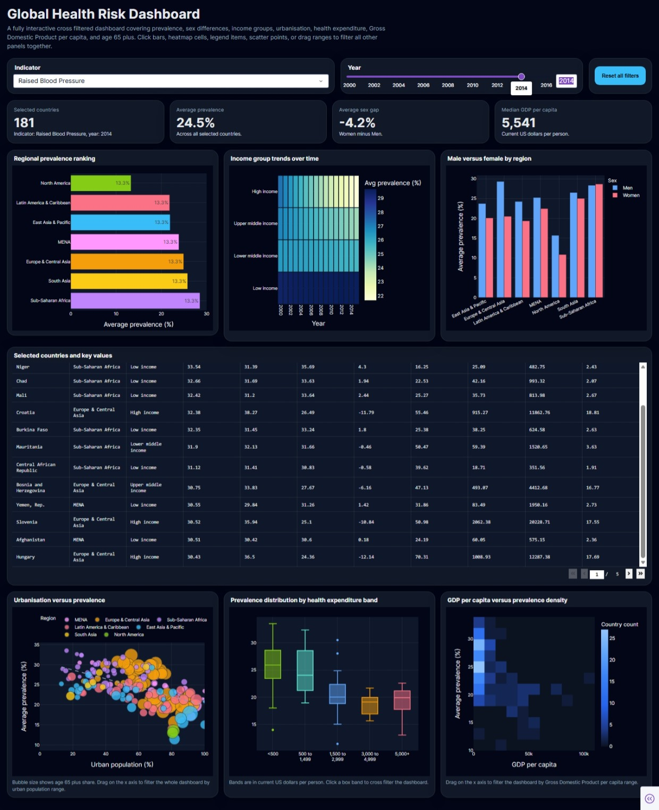
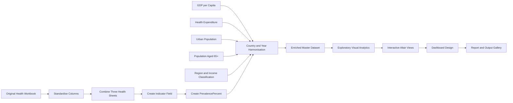
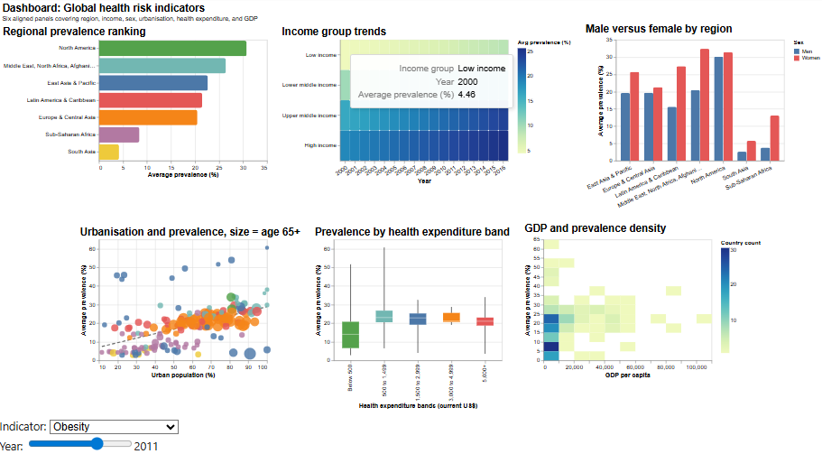

<div align="center">

# Global Cardiometabolic Inequality

## Exploring Obesity, Diabetes and Raised Blood Pressure Through Visual Analytics

**An end-to-end Python visual analytics project examining how cardiometabolic risk varies across countries, time, sex, regions, income groups and socioeconomic conditions.**

**Python · Pandas · NumPy · Altair · Plotly · Dash · Jupyter Notebook**

</div>

---

<p align="center">
  
</p>

---

## Project Overview

Cardiometabolic conditions are among the most important public-health challenges worldwide. Obesity, diabetes and raised blood pressure contribute to cardiovascular disease, long-term illness, reduced quality of life and increasing pressure on healthcare systems.

However, these risks do not affect every country or population group in the same way.

This project combines global health prevalence data with economic, demographic and development indicators to investigate:

* How cardiometabolic risk has changed over time
* Which countries carry the highest burden
* How prevalence differs between men and women
* How patterns vary across regions and income groups
* Whether economic development, urbanisation, population ageing and healthcare spending are associated with different health outcomes
* Which countries are experiencing the fastest increases in prevalence

The result is a complete visual analytics workflow covering data cleaning, harmonisation, enrichment, exploratory analysis, interactive visualisation and dashboard development.

---

## Quick Links

| Resource                | Link                                                                                                      |
| ----------------------- | --------------------------------------------------------------------------------------------------------- |
| Main analysis notebook  | [Open the Jupyter Notebook](notebook/global_cardiometabolic_inequality_analysis.ipynb)                    |
| Full academic report    | [Read the PDF Report](report/CST4245%20CW1%20Report%20-%20M00848704%20-%20Muhammad%20Siraj%20Bilal.pdf)   |
| Editable report         | [Open the DOCX Report](report/CST4245%20CW1%20Report%20-%20M00848704%20-%20Muhammad%20Siraj%20Bilal.docx) |
| Final dashboard preview | [View the Dashboard](outputs/FinalDB.jpeg)                                                                |
| Visual output gallery   | [Browse All Outputs](outputs/)                                                                            |
| Enriched final dataset  | [Open the Final Master Dataset](outputs/final%20master%20dataset%20complete.csv)                          |

---

## Core Research Question

> How do obesity, diabetes and raised blood pressure vary across countries and over time, and how are these patterns associated with demographic, regional and socioeconomic conditions?

The analysis is organised as a visual story that moves from broad global trends to increasingly detailed comparisons:

1. Global burden and long-term trends
2. Country-level rankings and trajectories
3. Sex-based differences
4. Regional and income inequalities
5. Socioeconomic and demographic relationships
6. Outliers and countries with the fastest increases
7. Interactive dashboard exploration

---

## Health Indicators

The project analyses three major cardiometabolic risk indicators:

| Indicator                 | Definition                                          |
| ------------------------- | --------------------------------------------------- |
| **Obesity**               | Prevalence of BMI greater than or equal to 30 kg/m² |
| **Diabetes**              | Age-standardised diabetes prevalence                |
| **Raised blood pressure** | Prevalence of raised blood pressure                 |

Each health record is organised by:

* Country
* Year
* Sex
* Indicator
* Prevalence
* Region
* Income group

---

## Data Enrichment

The original coursework workbook contained separate sheets for obesity, diabetes and raised blood pressure by country, sex and year.

To create a deeper analytical framework, the health data was enriched with external country-level indicators:

| Enrichment variable                       | Analytical purpose                                           |
| ----------------------------------------- | ------------------------------------------------------------ |
| **GDP per capita**                        | Represents national economic development                     |
| **Current health expenditure per capita** | Provides context on healthcare spending                      |
| **Urban population percentage**           | Supports analysis of urbanisation and lifestyle-related risk |
| **Population aged 65 and above**          | Represents population ageing                                 |
| **Income group**                          | Supports comparison across development levels                |
| **World Bank region**                     | Supports broader geographical comparison                     |

The external indicators were merged with the health records primarily using country and year.

---

## Data Pipeline



---

## Data Preparation

The preparation process includes:

* Importing the three health-indicator sheets
* Standardising prevalence-column names
* Creating a shared `Indicator` variable
* Combining the separate sheets into one table
* Converting prevalence values into percentages
* Reshaping World Bank data from wide to long format
* Standardising year formats
* Harmonising country names across sources
* Resolving country-name mismatches
* Merging economic and demographic indicators
* Adding region and income classifications
* Filtering records where contextual variables are unavailable
* Creating aggregated and derived analytical measures
* Exporting intermediate and final master datasets

### Key Derived Variables

```text
Indicator
PrevalencePercent
GDPPerCapita
HealthExpenditurePerCapita
UrbanPopulationPercent
Population65PlusPercent
IncomeGroup
Region
```

---

## Visual Analytics Strategy

The visual design follows a question-driven approach. Each chart type was selected according to the comparison it needed to support.

| Analytical task             | Visual approach                          |
| --------------------------- | ---------------------------------------- |
| Long-term change            | Interactive line charts                  |
| Country comparison          | Ranked bars and lollipop charts          |
| Country trajectories        | Focus-and-context line charts            |
| Male-female comparison      | Lines, summary cards and dumbbell charts |
| Regional patterns           | Heatmaps and trend charts                |
| Income-group distribution   | Boxplots and jittered points             |
| Regional rankings           | Bump charts                              |
| Socioeconomic relationships | Scatter and bubble charts                |
| Multivariable exploration   | Linked and brushed views                 |
| Dashboard summary           | Multi-panel interactive interface        |

The visual design prioritises:

* Accurate comparison through position and length
* Consistent colour use
* Clear titles and axis labels
* Interactive filtering where it improves exploration
* Restrained visual complexity
* Accessibility for technical and non-technical audiences
* Movement from overview to comparison and then detail

---

## Dashboard Experience

The project evolved from individual Altair visualisations into a consolidated dashboard experience.

The dashboard is designed to let users explore the same health problem from multiple perspectives without being restricted to one static chart.

### Interactive Features

* Indicator selection
* Year filtering
* Country comparison
* Region filtering
* Income-group comparison
* Sex-based analysis
* Hover tooltips
* Linked views
* Range selection
* Brushing and filtering
* Country ranking tables
* Summary metrics
* Socioeconomic relationship panels

<p align="center">
  
</p>

The dashboard supports a progression from:

```text
Overview → Global Trend → Country Ranking → Inequality → Context → Detail
```

---

# Key Findings

## 1. The Three Indicators Follow Different Global Paths

The project demonstrates that cardiometabolic risk is not one uniform global story.

| Indicator                 | Average prevalence across the analysed period | Long-term direction |
| ------------------------- | --------------------------------------------: | ------------------- |
| **Raised blood pressure** |                                    **27.81%** | Declining           |
| **Obesity**               |                                    **13.47%** | Strongly increasing |
| **Diabetes**              |                                     **7.51%** | Increasing          |

Raised blood pressure remained the highest overall burden, but average prevalence declined from just above 30% in the mid-1970s to approximately 24% near the end of the series.

Obesity showed the strongest increase, rising from roughly 7% to above 21%.

Diabetes also increased, moving from approximately 5% to around 10%.

This means that progress in raised blood pressure does not represent progress across all cardiometabolic conditions.

---

## 2. High-Burden Countries Differ by Indicator

The countries with the highest prevalence are not the same across all conditions.

### Obesity and Diabetes

Pacific Island settings appear prominently, including:

* Nauru
* American Samoa
* Cook Islands
* Palau
* Marshall Islands
* Tonga
* Samoa
* Tuvalu

Several Middle Eastern countries also appear among high-prevalence cases.

### Raised Blood Pressure

Raised blood pressure presents a different geographical pattern, with several high-burden countries concentrated in Sub-Saharan Africa, including:

* Niger
* Somalia
* Chad
* Mali
* Burkina Faso

This demonstrates that cardiometabolic burden has different geographies and requires indicator-specific responses.

---

## 3. Sex Differences Depend on the Indicator

Sex inequality is substantial, but its direction changes across conditions.

### Obesity

Women show consistently higher obesity prevalence across many countries and throughout the study period.

Some of the largest female disadvantages appear in countries such as:

* South Africa
* Lesotho
* Botswana
* Eswatini
* Zimbabwe

### Raised Blood Pressure

Men generally show higher raised blood pressure prevalence than women.

### Diabetes

The male-female difference is smaller and more balanced, with the gap narrowing over time at the global level.

The findings show that one general statement about sex and cardiometabolic risk would be misleading.

---

## 4. Regional Inequality Is Persistent but Dynamic

Regional patterns vary significantly across indicators.

* **North America** and parts of the **Middle East and North Africa** show high obesity prevalence.
* The **Middle East and North Africa** grouping records some of the highest diabetes levels.
* **Sub-Saharan Africa** retains a persistently high burden of raised blood pressure.
* Several regions show strong increases in obesity and diabetes even where raised blood pressure has improved.

Regional priorities should therefore differ according to the indicator and the direction of change.

---

## 5. Income Matters, but It Does Not Explain Everything

Obesity shows the clearest income gradient, with higher average prevalence and greater spread in upper-middle-income and high-income groups.

Raised blood pressure remains widespread across income categories.

Diabetes displays overlapping distributions between income groups.

Countries within the same income classification can still have very different risk profiles, meaning that income grouping is useful for context but cannot replace country-level analysis.

---

## 6. Socioeconomic Relationships Are Complex

The project explores relationships between health prevalence and:

* GDP per capita
* Urban population percentage
* Population ageing
* Current health expenditure per capita

The findings indicate that these variables matter, but none provides a complete explanation on its own.

### Examples

* Greater urbanisation is associated with higher obesity in several settings, but the relationship is not universal.
* Population ageing provides useful context for diabetes and raised blood pressure.
* Higher health expenditure does not automatically correspond to lower cardiometabolic burden.
* Countries at similar economic levels may still display very different prevalence patterns.

These results should be interpreted as observed associations rather than proof of causation.

---

## 7. Public-Health Responses Should Be Targeted

The analysis suggests that cardiometabolic conditions should not be treated as one combined problem with a single global response.

Potential priorities include:

* Earlier prevention and lifestyle-focused action where obesity and diabetes are rising rapidly
* Stronger screening and long-term management where raised blood pressure remains persistently high
* Women-focused obesity interventions where female disadvantage is substantial
* Greater attention to men in raised-blood-pressure screening
* Country-specific strategies that reflect regional, economic and demographic context

---

## Analytical Questions Addressed

The project answers seven linked questions:

1. How have obesity, diabetes and raised blood pressure changed globally over time?
2. Which countries record the highest prevalence?
3. How do selected country trajectories compare with broader regional patterns?
4. How do prevalence levels differ between men and women?
5. How do regional and income-group patterns vary?
6. What relationships exist between prevalence and national socioeconomic conditions?
7. Which countries and groups emerge as outliers or show the fastest increases?

---

## Repository Structure

```text
global-cardiometabolic-inequality-visual-analytics/
│
├── data/
│   ├── cw1 -dataset.xlsx
│   ├── GDP.csv
│   ├── Health Expenditure.csv
│   ├── Urban Population.csv
│   ├── 65 and Above.csv
│   └── country classification files
│
├── notebook/
│   └── global_cardiometabolic_inequality_analysis.ipynb
│
├── outputs/
│   ├── FinalDB.jpeg
│   ├── AltairDB.png
│   ├── V1.png
│   ├── V2ob.png
│   ├── V2db.png
│   ├── V2bp.png
│   ├── additional visual outputs
│   ├── master health dataset.csv
│   ├── final master dataset.csv
│   └── final master dataset complete.csv
│
├── report/
│   ├── CST4245 CW1 Report - M00848704 - Muhammad Siraj Bilal.pdf
│   └── CST4245 CW1 Report - M00848704 - Muhammad Siraj Bilal.docx
│
├── requirements.txt
├── .gitignore
└── README.md
```

---

## Technology Stack

### Data Preparation

* Python
* Pandas
* NumPy
* OpenPyXL

### Visual Analytics

* Altair
* Matplotlib
* Seaborn

### Dashboard and Interactivity

* Plotly
* Dash

### Development Environment

* Jupyter Notebook

### Additional Utilities

* SciPy
* Requests

---

## Installation

Clone the repository:

```bash
git clone https://github.com/Muhammad-Siraj-Bilal/global-cardiometabolic-inequality-visual-analytics.git
cd global-cardiometabolic-inequality-visual-analytics
```

Create a virtual environment:

```bash
python -m venv .venv
```

Activate it on Windows:

```bash
.venv\Scripts\activate
```

Activate it on macOS or Linux:

```bash
source .venv/bin/activate
```

Install the dependencies:

```bash
pip install -r requirements.txt
```

Start Jupyter Notebook:

```bash
jupyter notebook
```

Then open:

```text
notebook/global_cardiometabolic_inequality_analysis.ipynb
```

---

## Path Configuration

The notebook was originally developed in a local Windows environment.

For portable execution, use repository-relative paths near the beginning of the notebook:

```python
from pathlib import Path

PROJECT_ROOT = Path.cwd()

if PROJECT_ROOT.name == "notebook":
    PROJECT_ROOT = PROJECT_ROOT.parent

DATA_DIR = PROJECT_ROOT / "data"
OUTPUT_DIR = PROJECT_ROOT / "outputs"

health_file = DATA_DIR / "cw1 -dataset.xlsx"
gdp_file = DATA_DIR / "GDP.csv"
health_expenditure_file = DATA_DIR / "Health Expenditure.csv"
urban_population_file = DATA_DIR / "Urban Population.csv"
age_65_file = DATA_DIR / "65 and Above.csv"
```

Example:

```python
health_data = pd.ExcelFile(health_file)
gdp = pd.read_csv(gdp_file, skiprows=4)
```

Save generated files using:

```python
master.to_csv(
    OUTPUT_DIR / "master health dataset.csv",
    index=False
)
```

---

## Reproducing the Analysis

Run the notebook from top to bottom in the following sequence:

1. Install and import packages
2. Load the original health workbook
3. Standardise and combine the three indicator sheets
4. Create `Indicator` and `PrevalencePercent`
5. Import and reshape World Bank datasets
6. Harmonise country names
7. Merge contextual variables
8. Add regional and income classifications
9. Export enriched master datasets
10. Generate the visual analysis
11. Review the saved outputs
12. Compare the results with the full written report

The notebook outputs were cleared before being committed to keep the file within GitHub's size limits. The rendered visualisations are preserved separately in the `outputs/` directory.

---

## Output Gallery

The repository includes an extensive collection of saved visualisations covering:

* Global trends
* Top-country rankings
* Country trajectories
* Sex differences
* Country-level gender gaps
* Regional heatmaps
* Income-group distributions
* Regional rankings
* GDP relationships
* Urbanisation patterns
* Population-ageing patterns
* Health-expenditure comparisons
* Correlation analysis
* Fastest-rising countries
* Dashboard prototypes
* Final dashboard layouts

Browse them here:

[Open the Visual Output Gallery](outputs/)

---

## Data Sources

The analysis combines:

* The original coursework health-prevalence workbook
* World Bank GDP per capita data
* World Bank current health expenditure per capita data
* World Bank urban population data
* World Bank population aged 65 and above data
* World Bank country, regional and lending-group classifications

Full source details and references are provided in the academic report.

---

## Limitations

The project should be interpreted with the following considerations:

* Not every country has complete values for every socioeconomic indicator.
* Some relationship-based visuals use filtered subsets of the full health dataset.
* Socioeconomic indicators are available at country level rather than separately by sex.
* Country-level associations do not demonstrate direct causation.
* Differences in source coverage may affect comparisons across indicators and years.

These limitations do not prevent meaningful visual analysis, but they are important when interpreting relationships between prevalence and national development conditions.

---

## Why This Project Matters

This project demonstrates how thoughtful visual analytics can transform a collection of disconnected health tables into an integrated view of global inequality.

It shows the importance of:

* Combining health and development data
* Looking beyond global averages
* Comparing multiple indicators rather than treating cardiometabolic risk as one condition
* Examining differences across sex, geography and income
* Designing visuals around analytical questions
* Using interactivity to move between overview and detail
* Communicating complex findings to both technical and non-technical audiences

The project is relevant to:

* Public-health analysts
* Healthcare planners
* Government agencies
* International development organisations
* Data scientists
* Researchers
* Policy decision-makers
* Visualisation practitioners

---

## Academic Context

This project was completed for:

**CST4245: Data Visualisation, Computer Vision and Imaging**
**MSc Data Science and Artificial Intelligence**
**Middlesex University Dubai**

Supervisor:

**Sudhakar Camilos Fernando**

---

## Author

**Muhammad Siraj Bilal**

---

## Usage Notice

This repository is provided for educational, academic and portfolio purposes.

The original datasets remain subject to the terms and conditions of their respective providers. The analysis identifies patterns and associations and should not be treated as medical advice or as proof of causal relationships.

---

<div align="center">

### Turning global health data into a visual story of inequality, change and context.

</div>
